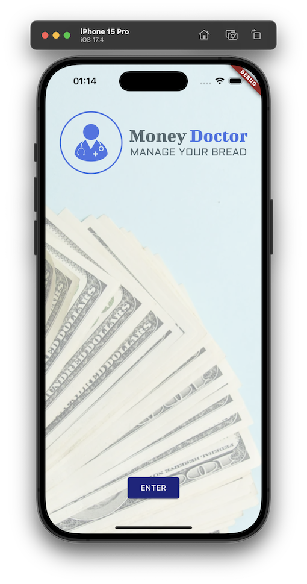
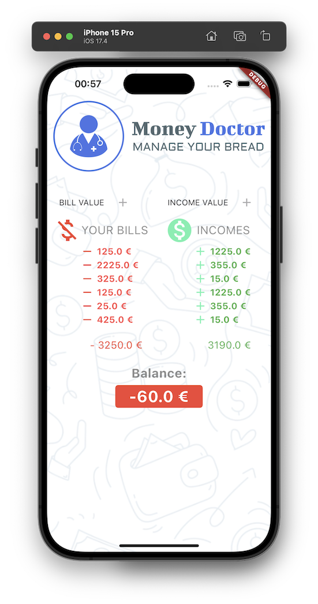

# money_doctor

A new Flutter project.

Link Trello: https://trello.com/b/I5JRCY5G/money-doctor

Link Planner: https://tasks.office.com/uabpt.onmicrosoft.com/pt-PT/Home/Planner/#/plantaskboard?groupId=1f221545-d4fe-4617-b1a4-8e2b2b707b36&planId=Py_mYcfOFUOOoUzegRjEMZYAEfXG

## Motivation

In today's rapidly accelerating world, where financial transactions occur with the tap of a screen, effective financial management has become more critical than ever. The advent of digital technologies has significantly transformed the landscape of personal finance, leading to the emergence of financial management applications that serve as indispensable tools for individuals and businesses alike. These applications, often referred to as personal finance apps, are software solutions designed to assist users in efficiently managing their finances. They offer a wide range of functionalities, including budget tracking, expense management, bill payment reminders, investment tracking, and goal setting. By providing real-time information about their financial activities, these apps empower users to make informed decisions and take control of their financial well-being.

The history of financial management applications dates back to the early 21st century, coinciding with the rise of smartphones and the proliferation of mobile apps. As mobile technology became more accessible, developers began creating tailored applications to address various aspects of personal finance. The initial offerings were rudimentary, providing basic functionalities such as expense tracking and budgeting. However, with technological advancements and increasing demand for more robust solutions, financial management apps evolved into sophisticated platforms capable of handling complex financial tasks. These apps play a crucial role in promoting financial literacy and fostering responsible financial habits in today's society, where complexity and financial uncertainty prevail. They enable users to control expenses, identify areas for saving, and plan for the future effectively. Additionally, in businesses, these apps streamline accounting processes, enhance transparency, and facilitate better decision-making.

### MoneyDoctor Example

